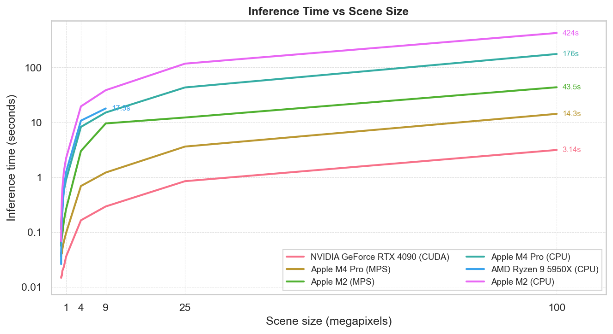

# Benchmarks

:::{note}
To add results for your hardware, see [`benchmarking/README.md`](https://github.com/DPIRD-DMA/OmniCloudMask/blob/main/benchmarking/README.md) for instructions, then submit the JSON file in `benchmarking/results/` via a pull request.
:::

Inference time for a square scene at various sizes.
Results show mean seconds over multiple runs.
Batch size was selected automatically by searching for the fastest value on each device.

## Summary

| Megapixels | Dimensions | NVIDIA GeForce RTX 4090 (CUDA) | Apple M4 Pro (MPS) | Apple M2 (MPS) | Apple M4 Pro (CPU) | AMD Ryzen 9 5950X (CPU) | Apple M2 (CPU) |
| --- | --- | --- | --- | --- | --- | --- | --- |
| **0.003** | 50×50 | 0.015s | 0.036s | 0.073s | 0.113s | 0.026s | 0.068s |
| **0.01** | 100×100 | 0.01s | 0.04s | 0.06s | 0.15s | 0.05s | 0.09s |
| **0.04** | 200×200 | 0.02s | 0.04s | 0.06s | 0.17s | 0.05s | 0.15s |
| **0.09** | 300×300 | 0.02s | 0.04s | 0.07s | 0.21s | 0.09s | 0.26s |
| **0.16** | 400×400 | 0.02s | 0.04s | 0.08s | 0.24s | 0.15s | 0.41s |
| **0.25** | 500×500 | 0.02s | 0.05s | 0.09s | 0.33s | 0.23s | 0.62s |
| **0.56** | 750×750 | 0.02s | 0.07s | 0.16s | 0.57s | 0.61s | 1.28s |
| **1** | 1000×1000 | 0.04s | 0.10s | 0.26s | 0.90s | 1.23s | 2.22s |
| **4** | 2000×2000 | 0.16s | 0.69s | 3.00s | 8.25s | 10.73s | 19.50s |
| **9** | 3000×3000 | 0.29s | 1.22s | 9.54s | 15.08s | 17.87s | 38.46s |
| **25** | 5000×5000 | 0.85s | 3.61s | 12.23s | 43.16s | — | 117.14s |
| **100** | 10000×10000 | 3.14s | 14.26s | 43.51s | 175.53s | — | 424.02s |

## NVIDIA GeForce RTX 4090 (CUDA)

OmniCloudMask 1.7.1 &middot; Linux 6.8.0-106-generic &middot; 125.7 GB RAM

| Megapixels | Dimensions | fp32 | Batch (fp32) | fp16 | Batch (fp16) |
| --- | --- | --- | --- | --- | --- |
| **0.003** | 50×50 | 0.013s | 1 | 0.015s | 1 |
| **0.01** | 100×100 | 0.01s | 1 | 0.01s | 1 |
| **0.04** | 200×200 | 0.02s | 1 | 0.02s | 1 |
| **0.09** | 300×300 | 0.02s | 1 | 0.02s | 1 |
| **0.16** | 400×400 | 0.02s | 1 | 0.02s | 1 |
| **0.25** | 500×500 | 0.02s | 1 | 0.02s | 1 |
| **0.56** | 750×750 | 0.03s | 1 | 0.02s | 1 |
| **1** | 1000×1000 | 0.04s | 1 | 0.04s | 1 |
| **4** | 2000×2000 | 0.21s | 2 | 0.16s | 4 |
| **9** | 3000×3000 | 0.40s | 4 | 0.29s | 4 |
| **25** | 5000×5000 | 1.08s | 4 | 0.85s | 4 |
| **100** | 10000×10000 | 4.11s | 4 | 3.14s | 4 |

## Apple M4 Pro (MPS)

OmniCloudMask 1.7.1 &middot; Darwin 25.2.0 &middot; 64.0 GB RAM

| Megapixels | Dimensions | fp32 | Batch (fp32) | fp16 | Batch (fp16) |
| --- | --- | --- | --- | --- | --- |
| **0.003** | 50×50 | 0.033s | 1 | 0.036s | 1 |
| **0.01** | 100×100 | 0.04s | 1 | 0.04s | 1 |
| **0.04** | 200×200 | 0.04s | 1 | 0.04s | 1 |
| **0.09** | 300×300 | 0.04s | 1 | 0.04s | 1 |
| **0.16** | 400×400 | 0.04s | 1 | 0.04s | 1 |
| **0.25** | 500×500 | 0.05s | 1 | 0.05s | 1 |
| **0.56** | 750×750 | 0.07s | 1 | 0.07s | 1 |
| **1** | 1000×1000 | 0.12s | 1 | 0.10s | 1 |
| **4** | 2000×2000 | 0.90s | 1 | 0.69s | 1 |
| **9** | 3000×3000 | 1.62s | 4 | 1.22s | 4 |
| **25** | 5000×5000 | 4.69s | 4 | 3.61s | 1 |
| **100** | 10000×10000 | 17.77s | 4 | 14.26s | 1 |

## Apple M2 (MPS)

OmniCloudMask 1.7.1 &middot; Darwin 24.6.0 &middot; 16.0 GB RAM

| Megapixels | Dimensions | fp32 | Batch (fp32) | fp16 | Batch (fp16) |
| --- | --- | --- | --- | --- | --- |
| **0.003** | 50×50 | 0.051s | 1 | 0.073s | 1 |
| **0.01** | 100×100 | 0.05s | 1 | 0.06s | 1 |
| **0.04** | 200×200 | 0.07s | 1 | 0.06s | 1 |
| **0.09** | 300×300 | 0.07s | 1 | 0.07s | 1 |
| **0.16** | 400×400 | 0.09s | 1 | 0.08s | 1 |
| **0.25** | 500×500 | 0.10s | 1 | 0.09s | 1 |
| **0.56** | 750×750 | 0.19s | 1 | 0.16s | 1 |
| **1** | 1000×1000 | 0.30s | 1 | 0.26s | 1 |
| **4** | 2000×2000 | 2.98s | 1 | 3.00s | 1 |
| **9** | 3000×3000 | 4.12s | 2 | 9.54s | 4 |
| **25** | 5000×5000 | 12.70s | 2 | 12.23s | 1 |
| **100** | 10000×10000 | 53.64s | 2 | 43.51s | 1 |

## Apple M4 Pro (CPU)

OmniCloudMask 1.7.1 &middot; Darwin 25.2.0 &middot; 64.0 GB RAM

| Megapixels | Dimensions | fp32 | Batch |
| --- | --- | --- | --- |
| **0.003** | 50×50 | 0.113s | 1 |
| **0.01** | 100×100 | 0.15s | 1 |
| **0.04** | 200×200 | 0.17s | 1 |
| **0.09** | 300×300 | 0.21s | 1 |
| **0.16** | 400×400 | 0.24s | 1 |
| **0.25** | 500×500 | 0.33s | 1 |
| **0.56** | 750×750 | 0.57s | 1 |
| **1** | 1000×1000 | 0.90s | 1 |
| **4** | 2000×2000 | 8.25s | 1 |
| **9** | 3000×3000 | 15.08s | 1 |
| **25** | 5000×5000 | 43.16s | 1 |
| **100** | 10000×10000 | 175.53s | 1 |

## AMD Ryzen 9 5950X (CPU)

OmniCloudMask 1.7.1 &middot; Linux 6.8.0-106-generic &middot; 125.7 GB RAM

| Megapixels | Dimensions | fp32 | Batch |
| --- | --- | --- | --- |
| **0.003** | 50×50 | 0.026s | 1 |
| **0.01** | 100×100 | 0.05s | 1 |
| **0.04** | 200×200 | 0.05s | 1 |
| **0.09** | 300×300 | 0.09s | 1 |
| **0.16** | 400×400 | 0.15s | 1 |
| **0.25** | 500×500 | 0.23s | 1 |
| **0.56** | 750×750 | 0.61s | 1 |
| **1** | 1000×1000 | 1.23s | 1 |
| **4** | 2000×2000 | 10.73s | 1 |
| **9** | 3000×3000 | 17.87s | 1 |

## Apple M2 (CPU)

OmniCloudMask 1.7.1 &middot; Darwin 24.6.0 &middot; 16.0 GB RAM

| Megapixels | Dimensions | fp32 | Batch |
| --- | --- | --- | --- |
| **0.003** | 50×50 | 0.068s | 1 |
| **0.01** | 100×100 | 0.09s | 1 |
| **0.04** | 200×200 | 0.15s | 1 |
| **0.09** | 300×300 | 0.26s | 1 |
| **0.16** | 400×400 | 0.41s | 1 |
| **0.25** | 500×500 | 0.62s | 1 |
| **0.56** | 750×750 | 1.28s | 1 |
| **1** | 1000×1000 | 2.22s | 1 |
| **4** | 2000×2000 | 19.50s | 1 |
| **9** | 3000×3000 | 38.46s | 4 |
| **25** | 5000×5000 | 117.14s | 4 |
| **100** | 10000×10000 | 424.02s | 1 |
