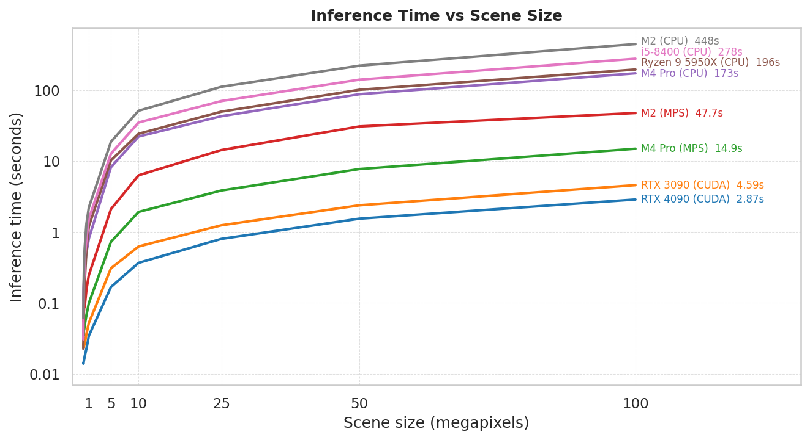

# Performance

## Performance notes

- **Device hierarchy**: In general, CUDA GPUs are fastest, followed by MPS (Apple Silicon GPU), then CPU. The gap widens with scene size. At small scenes the difference is modest, but at 100 MP a high-end CUDA GPU can be over 100x faster than a CPU.
- **Tiling and scaling**: Scenes up to 1000x1000 px (1 MP) are processed as a single tile. On GPUs, small scenes are dominated by fixed overhead so times stay nearly flat up to 1 MP. Above 1 MP the scene is split into 1000x1000 px tiles with 300 px overlap, and inference time scales roughly linearly with megapixels.
- **Batch size**: For tiled scenes (>1 MP), processing multiple tiles per batch can significantly speed up GPU inference.
- **fp16 vs fp32**: On CUDA and MPS, fp16 inference is typically faster than fp32 with no meaningful change in output quality.

Inference time for a square scene at various sizes. Results show mean seconds over multiple runs. Batch size was selected automatically by searching for the fastest value on each device. CPU gains little from batching since it lacks the massive parallelism of a GPU. fp16 was not tested on CPU as it does not offer any performance benefit. bfloat16 is also supported by the library but has equivalent throughput to fp16 on modern GPUs, so it was not evaluated separately.

| Megapixels | NVIDIA GeForce RTX 4090 (CUDA) | NVIDIA GeForce RTX 3090 (CUDA) | Apple M4 Pro (MPS) | Apple M2 (MPS) | Apple M4 Pro (CPU) | AMD Ryzen 9 5950X (CPU) | Intel Core i5-8400 (CPU) | Apple M2 (CPU) |
| --- | --- | --- | --- | --- | --- | --- | --- | --- |
| **0.003 MP** (50×50 px) | 0.014s | 0.026s | 0.040s | 0.068s | 0.109s | 0.022s | 0.031s | 0.061s |
| **0.01 MP** (100×100 px) | 0.01s | 0.03s | 0.04s | 0.05s | 0.14s | 0.03s | 0.09s | 0.09s |
| **0.04 MP** (200×200 px) | 0.01s | 0.02s | 0.03s | 0.07s | 0.16s | 0.05s | 0.14s | 0.15s |
| **0.09 MP** (300×300 px) | 0.02s | 0.02s | 0.04s | 0.07s | 0.20s | 0.09s | 0.21s | 0.26s |
| **0.16 MP** (400×400 px) | 0.02s | 0.03s | 0.04s | 0.09s | 0.23s | 0.14s | 0.25s | 0.44s |
| **0.25 MP** (500×500 px) | 0.02s | 0.03s | 0.05s | 0.09s | 0.33s | 0.20s | 0.42s | 0.61s |
| **0.56 MP** (750×750 px) | 0.02s | 0.04s | 0.07s | 0.16s | 0.52s | 0.58s | 0.81s | 1.32s |
| **1 MP** (1000×1000 px) | 0.03s | 0.05s | 0.10s | 0.25s | 0.81s | 1.21s | 1.55s | 2.23s |
| **4 MP** (2000×2000 px) | 0.15s | 0.26s | 0.73s | 2.15s | 7.76s | 9.78s | 12.65s | 18.17s |
| **5 MP** (2236×2236 px) | 0.17s | 0.31s | 0.73s | 2.10s | 8.21s | 10.23s | 12.74s | 18.75s |
| **9 MP** (3000×3000 px) | 0.29s | 0.46s | 1.29s | 4.01s | 14.39s | 15.81s | 22.92s | 34.28s |
| **10 MP** (3162×3162 px) | 0.37s | 0.62s | 1.92s | 6.31s | 22.21s | 24.31s | 35.02s | 51.31s |
| **25 MP** (5000×5000 px) | 0.80s | 1.24s | 3.85s | 14.33s | 43.02s | 49.87s | 70.36s | 111.80s |
| **50 MP** (7071×7071 px) | 1.54s | 2.38s | 7.72s | 30.84s | 87.86s | 101.34s | 141.03s | 222.17s |
| **100 MP** (10000×10000 px) | 2.87s | 4.59s | 14.95s | 47.71s | 173.11s | 196.03s | 278.31s | 447.78s |

## NVIDIA GeForce RTX 4090 (CUDA)

OmniCloudMask 1.7.1 &middot; Linux 6.8.0-106-generic &middot; 125.7 GB RAM

| Scene size | fp32 | Batch (fp32) | fp16 | Batch (fp16) |
| --- | --- | --- | --- | --- |
| **0.003 MP** (50×50 px) | 0.013s | 1 | 0.014s | 1 |
| **0.01 MP** (100×100 px) | 0.01s | 1 | 0.01s | 1 |
| **0.04 MP** (200×200 px) | 0.01s | 1 | 0.01s | 1 |
| **0.09 MP** (300×300 px) | 0.01s | 1 | 0.02s | 1 |
| **0.16 MP** (400×400 px) | 0.02s | 1 | 0.02s | 1 |
| **0.25 MP** (500×500 px) | 0.02s | 1 | 0.02s | 1 |
| **0.56 MP** (750×750 px) | 0.03s | 1 | 0.02s | 1 |
| **1 MP** (1000×1000 px) | 0.04s | 1 | 0.03s | 1 |
| **4 MP** (2000×2000 px) | 0.20s | 2 | 0.15s | 4 |
| **5 MP** (2236×2236 px) | 0.23s | 4 | 0.17s | 4 |
| **9 MP** (3000×3000 px) | 0.36s | 4 | 0.29s | 4 |
| **10 MP** (3162×3162 px) | 0.52s | 4 | 0.37s | 4 |
| **25 MP** (5000×5000 px) | 0.97s | 4 | 0.80s | 2 |
| **50 MP** (7071×7071 px) | 1.98s | 4 | 1.54s | 4 |
| **100 MP** (10000×10000 px) | 3.81s | 4 | 2.87s | 4 |

## NVIDIA GeForce RTX 3090 (CUDA)

OmniCloudMask 1.7.1 &middot; Linux 6.17.0-19-generic &middot; 62.7 GB RAM

| Scene size | fp32 | Batch (fp32) | fp16 | Batch (fp16) |
| --- | --- | --- | --- | --- |
| **0.003 MP** (50×50 px) | 0.020s | 1 | 0.026s | 1 |
| **0.01 MP** (100×100 px) | 0.02s | 1 | 0.03s | 1 |
| **0.04 MP** (200×200 px) | 0.02s | 1 | 0.02s | 1 |
| **0.09 MP** (300×300 px) | 0.02s | 1 | 0.02s | 1 |
| **0.16 MP** (400×400 px) | 0.02s | 1 | 0.03s | 1 |
| **0.25 MP** (500×500 px) | 0.03s | 1 | 0.03s | 1 |
| **0.56 MP** (750×750 px) | 0.04s | 1 | 0.04s | 1 |
| **1 MP** (1000×1000 px) | 0.06s | 1 | 0.05s | 1 |
| **4 MP** (2000×2000 px) | 0.37s | 2 | 0.26s | 2 |
| **5 MP** (2236×2236 px) | 0.39s | 2 | 0.31s | 2 |
| **9 MP** (3000×3000 px) | 0.61s | 2 | 0.46s | 4 |
| **10 MP** (3162×3162 px) | 0.91s | 4 | 0.62s | 4 |
| **25 MP** (5000×5000 px) | 1.81s | 4 | 1.24s | 4 |
| **50 MP** (7071×7071 px) | 3.46s | 4 | 2.38s | 4 |
| **100 MP** (10000×10000 px) | 6.90s | 4 | 4.59s | 4 |

## Apple M4 Pro (MPS)

OmniCloudMask 1.7.1 &middot; Darwin 25.2.0 &middot; 64.0 GB RAM

| Scene size | fp32 | Batch (fp32) | fp16 | Batch (fp16) |
| --- | --- | --- | --- | --- |
| **0.003 MP** (50×50 px) | 0.041s | 1 | 0.040s | 1 |
| **0.01 MP** (100×100 px) | 0.04s | 1 | 0.04s | 1 |
| **0.04 MP** (200×200 px) | 0.04s | 1 | 0.03s | 1 |
| **0.09 MP** (300×300 px) | 0.05s | 1 | 0.04s | 1 |
| **0.16 MP** (400×400 px) | 0.05s | 1 | 0.04s | 1 |
| **0.25 MP** (500×500 px) | 0.05s | 1 | 0.05s | 1 |
| **0.56 MP** (750×750 px) | 0.08s | 1 | 0.07s | 1 |
| **1 MP** (1000×1000 px) | 0.12s | 1 | 0.10s | 1 |
| **4 MP** (2000×2000 px) | 0.86s | 1 | 0.73s | 16 |
| **5 MP** (2236×2236 px) | 0.96s | 1 | 0.73s | 2 |
| **9 MP** (3000×3000 px) | 1.54s | 8 | 1.29s | 2 |
| **10 MP** (3162×3162 px) | 2.29s | 4 | 1.92s | 1 |
| **25 MP** (5000×5000 px) | 4.42s | 4 | 3.85s | 4 |
| **50 MP** (7071×7071 px) | 9.70s | 1 | 7.72s | 1 |
| **100 MP** (10000×10000 px) | 18.64s | 4 | 14.95s | 1 |

## Apple M2 (MPS)

OmniCloudMask 1.7.1 &middot; Darwin 24.6.0 &middot; 16.0 GB RAM

| Scene size | fp32 | Batch (fp32) | fp16 | Batch (fp16) |
| --- | --- | --- | --- | --- |
| **0.003 MP** (50×50 px) | 0.051s | 1 | 0.068s | 1 |
| **0.01 MP** (100×100 px) | 0.05s | 1 | 0.05s | 1 |
| **0.04 MP** (200×200 px) | 0.08s | 1 | 0.07s | 1 |
| **0.09 MP** (300×300 px) | 0.07s | 1 | 0.07s | 1 |
| **0.16 MP** (400×400 px) | 0.09s | 1 | 0.09s | 1 |
| **0.25 MP** (500×500 px) | 0.10s | 1 | 0.09s | 1 |
| **0.56 MP** (750×750 px) | 0.18s | 1 | 0.16s | 1 |
| **1 MP** (1000×1000 px) | 0.30s | 1 | 0.25s | 1 |
| **4 MP** (2000×2000 px) | 2.33s | 4 | 2.15s | 2 |
| **5 MP** (2236×2236 px) | 2.34s | 2 | 2.10s | 4 |
| **9 MP** (3000×3000 px) | 4.03s | 4 | 4.01s | 1 |
| **10 MP** (3162×3162 px) | 8.63s | 4 | 6.31s | 1 |
| **25 MP** (5000×5000 px) | 15.89s | 1 | 14.33s | 2 |
| **50 MP** (7071×7071 px) | 27.95s | 1 | 30.84s | 2 |
| **100 MP** (10000×10000 px) | 53.87s | 1 | 47.71s | 4 |

## Apple M4 Pro (CPU)

OmniCloudMask 1.7.1 &middot; Darwin 25.2.0 &middot; 64.0 GB RAM

| Scene size | fp32 | Batch |
| --- | --- | --- |
| **0.003 MP** (50×50 px) | 0.109s | 1 |
| **0.01 MP** (100×100 px) | 0.14s | 1 |
| **0.04 MP** (200×200 px) | 0.16s | 1 |
| **0.09 MP** (300×300 px) | 0.20s | 1 |
| **0.16 MP** (400×400 px) | 0.23s | 1 |
| **0.25 MP** (500×500 px) | 0.33s | 1 |
| **0.56 MP** (750×750 px) | 0.52s | 1 |
| **1 MP** (1000×1000 px) | 0.81s | 1 |
| **4 MP** (2000×2000 px) | 7.76s | 1 |
| **5 MP** (2236×2236 px) | 8.21s | 1 |
| **9 MP** (3000×3000 px) | 14.39s | 1 |
| **10 MP** (3162×3162 px) | 22.21s | 1 |
| **25 MP** (5000×5000 px) | 43.02s | 1 |
| **50 MP** (7071×7071 px) | 87.86s | 1 |
| **100 MP** (10000×10000 px) | 173.11s | 1 |

## AMD Ryzen 9 5950X (CPU)

OmniCloudMask 1.7.1 &middot; Linux 6.8.0-106-generic &middot; 125.7 GB RAM

| Scene size | fp32 | Batch |
| --- | --- | --- |
| **0.003 MP** (50×50 px) | 0.022s | 1 |
| **0.01 MP** (100×100 px) | 0.03s | 1 |
| **0.04 MP** (200×200 px) | 0.05s | 1 |
| **0.09 MP** (300×300 px) | 0.09s | 1 |
| **0.16 MP** (400×400 px) | 0.14s | 1 |
| **0.25 MP** (500×500 px) | 0.20s | 1 |
| **0.56 MP** (750×750 px) | 0.58s | 1 |
| **1 MP** (1000×1000 px) | 1.21s | 1 |
| **4 MP** (2000×2000 px) | 9.78s | 1 |
| **5 MP** (2236×2236 px) | 10.23s | 1 |
| **9 MP** (3000×3000 px) | 15.81s | 1 |
| **10 MP** (3162×3162 px) | 24.31s | 1 |
| **25 MP** (5000×5000 px) | 49.87s | 1 |
| **50 MP** (7071×7071 px) | 101.34s | 1 |
| **100 MP** (10000×10000 px) | 196.03s | 1 |

## Intel Core i5-8400 (CPU)

OmniCloudMask 1.7.1 &middot; Linux 6.17.0-19-generic &middot; 62.7 GB RAM

| Scene size | fp32 | Batch |
| --- | --- | --- |
| **0.003 MP** (50×50 px) | 0.031s | 1 |
| **0.01 MP** (100×100 px) | 0.09s | 1 |
| **0.04 MP** (200×200 px) | 0.14s | 1 |
| **0.09 MP** (300×300 px) | 0.21s | 1 |
| **0.16 MP** (400×400 px) | 0.25s | 1 |
| **0.25 MP** (500×500 px) | 0.42s | 1 |
| **0.56 MP** (750×750 px) | 0.81s | 1 |
| **1 MP** (1000×1000 px) | 1.55s | 1 |
| **4 MP** (2000×2000 px) | 12.65s | 1 |
| **5 MP** (2236×2236 px) | 12.74s | 1 |
| **9 MP** (3000×3000 px) | 22.92s | 1 |
| **10 MP** (3162×3162 px) | 35.02s | 1 |
| **25 MP** (5000×5000 px) | 70.36s | 1 |
| **50 MP** (7071×7071 px) | 141.03s | 1 |
| **100 MP** (10000×10000 px) | 278.31s | 1 |

## Apple M2 (CPU)

OmniCloudMask 1.7.1 &middot; Darwin 24.6.0 &middot; 16.0 GB RAM

| Scene size | fp32 | Batch |
| --- | --- | --- |
| **0.003 MP** (50×50 px) | 0.061s | 1 |
| **0.01 MP** (100×100 px) | 0.09s | 1 |
| **0.04 MP** (200×200 px) | 0.15s | 1 |
| **0.09 MP** (300×300 px) | 0.26s | 1 |
| **0.16 MP** (400×400 px) | 0.44s | 1 |
| **0.25 MP** (500×500 px) | 0.61s | 1 |
| **0.56 MP** (750×750 px) | 1.32s | 1 |
| **1 MP** (1000×1000 px) | 2.23s | 1 |
| **4 MP** (2000×2000 px) | 18.17s | 1 |
| **5 MP** (2236×2236 px) | 18.75s | 1 |
| **9 MP** (3000×3000 px) | 34.28s | 1 |
| **10 MP** (3162×3162 px) | 51.31s | 1 |
| **25 MP** (5000×5000 px) | 111.80s | 1 |
| **50 MP** (7071×7071 px) | 222.17s | 1 |
| **100 MP** (10000×10000 px) | 447.78s | 1 |

---

To add results for your hardware, see [`benchmarking/README.md`](https://github.com/DPIRD-DMA/OmniCloudMask/blob/main/benchmarking/README.md) for instructions, then submit the JSON file in `benchmarking/results/` via a pull request.
