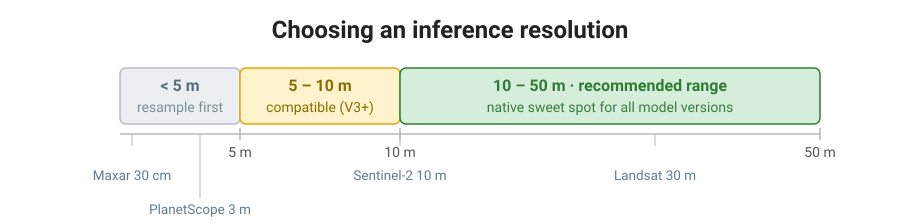

# Choosing a Resolution

OmniCloudMask works across a range of ground sample distances, not a single fixed resolution. This is by design — the models are trained with {ref}`mixed resolution training <mixed-resolution-training>`, which teaches them to recognise clouds and shadows at different spatial scales. This page helps you decide what resolution to run inference at for your data.

## Supported range

- **All model versions** are designed to work from **10 m to 50 m**. This is the native sweet spot.
- **Recent model versions (V3 and later)** were additionally trained on Sentinel-2 imagery super-resolved to 2× (the *CloudSEN12 High SR* dataset, see the [model changelog](model-changelog.md)). This extends support down to **5 m**.

While 5–10 m resolution is supported thanks to the super-resolution training data, this does not make 5 m more accurate than 10 m. The super-resolved imagery was paired with the original 10 m labels during training, so the extra resolution adds no detection detail — it only broadens the range of imagery the model can accept. Running at 5 m is therefore slower for no real accuracy gain, so 10 m is usually the better choice.

That said, 5 m inference does produce a 5 m mask, with finer cloud edges that line up with your higher-resolution imagery. So if you need the output to match a 5 m grid or simply look crisper alongside the source data, running at 5 m can be worthwhile despite the extra compute.



## What to do with your data

### Finer than 5 m (e.g. PlanetScope ~3 m, Maxar sub-metre)

Resample before running inference. You have two targets:

- **Resample to 10 m (recommended).** Faster, and no less accurate than 5 m.
- **Resample to 5 m (V3+ only).** Keeps more spatial detail and is supported by recent models, but is slower and gives similar accuracy to 10 m.

If you have, say, 3 m imagery, resampling to 10 m is the advised default.

### 10 m to 50 m

- **Use it as-is.** Native resolution within this range gives the best accuracy.
- **Or downsample toward 50 m for speed.** Coarser imagery means fewer pixels and faster inference, at a small accuracy cost. For example, processing Sentinel-2 at 20 m instead of 10 m reduces the pixel count by 4×.

:::{warning}
**Don't upsample coarse imagery to a finer resolution.** Resampling already-coarse data to a smaller ground sampling distance — for example upsampling 30 m Landsat to 10 m — does not improve accuracy. It adds no real detail, makes inference slower (more pixels to process), and feeds the model imagery unlike anything it saw during training. Run coarse imagery at its native resolution, or downsample it, but don't upsample.
:::

### Coarser than 50 m

Outside the trained range. You can still run inference, but accuracy is not validated beyond 50 m.

## Why higher resolution doesn't always mean higher accuracy

Cloud and shadow detection relies on texture and spatial relationships across a scene (see [How It Works](how-it-works.md)). Below roughly 10 m there is little additional information the model can use, so feeding it 5 m or finer imagery adds compute without adding accuracy. What matters far more than fine resolution is having enough surrounding **spatial context** — see the [Spatial Context](spatial-context.md) page for benchmarks on this.

## How to resample

For Sentinel-2, the built-in `load_s2` loader accepts a `resolution` argument:

```python
from functools import partial
from omnicloudmask import predict_from_load_func, load_s2

# Run Sentinel-2 at 20 m instead of native 10 m for faster inference
loader = partial(load_s2, resolution=20)

pred_paths = predict_from_load_func(scene_paths, loader)
```

`load_s2` only accepts resolutions from 10 m to 50 m — there is no benefit to upsampling Sentinel-2 below its native 10 m, so this is intentional.

For other sensors, use the built-in `load_multiband` loader, which resamples to a target resolution with its `resample_res` argument. This is how you resample finer imagery (PlanetScope, Maxar, etc.) down to 5 m or 10 m before inference:

```python
from functools import partial
from omnicloudmask import predict_from_load_func, load_multiband

# Resample ~3 m PlanetScope 4-band (Blue, Green, Red, NIR) to 10 m,
# selecting Red, Green, NIR
loader = partial(load_multiband, band_order=[3, 2, 4], resample_res=10)

pred_paths = predict_from_load_func(scene_paths, loader)
```

Set `resample_res=5` instead to run at 5 m on V3+ models. If you need full control over loading, you can also resample inside your own loader (e.g. with rasterio) before returning the array — see {ref}`Custom Data Loaders <custom-data-loaders>` for the loader interface.
