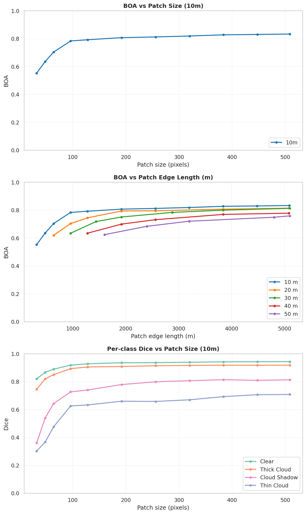

# Spatial Context

How much surrounding spatial context does OmniCloudMask need to accurately classify a small area? This page shows the impact of input patch size on accuracy when only the center 32×32 pixels are evaluated.

These results are relevant in two situations: when you have deliberately chosen a small `patch_size` for `predict_from_array` or `predict_from_load_func`, or when your input scene is small enough that OmniCloudMask automatically reduces the patch size to match the scene dimensions.

## Method

Evaluated on the CloudSEN12 High test set (975 scenes). For each scene, center patches of increasing size are extracted and predicted with OmniCloudMask. Only the center 32×32 pixels of each prediction are compared against the ground truth label. This isolates the effect of surrounding context on classification accuracy.

The experiment is repeated at simulated 20m, 30m, 40m, 50m resolution (bilinear downsampling of the native 10m Sentinel-2 imagery) to test whether coarser resolutions require different amounts of spatial context. Predictions at coarser resolutions are upsampled back to 10m with nearest-neighbour interpolation so all resolutions are evaluated against the same 10m ground truth.

## Metrics

**BOA (Balanced Overall Accuracy)** is the mean of per-class recall, averaged across all classes. Unlike overall accuracy, BOA gives equal weight to each class regardless of how many pixels it covers, so rare classes like thin cloud and cloud shadow are not drowned out by the dominant clear class.

$$BOA = 0.5 \left( \frac{TP}{TP + FN} + \frac{TN}{TN + FP} \right)$$

**Dice** (equivalent to F1 score) is reported per class. This shows which classes benefit most from additional context.

$$Dice = \frac{2TP}{2TP + FP + FN}$$

## Results

## Key findings

- **96 pixels is the practical minimum patch size.** At 10m resolution, BOA jumps from 0.55 at 32px to 0.78 at 96px, capturing the bulk of the accuracy gain. Beyond 96px, improvements continue but at a much slower rate (0.78 to 0.83 over the remaining range up to 509px). If you are working with small patches, expanding to at least 96×96 pixels will give the largest improvement per additional pixel.

- **Larger patches are always better.** Accuracy never plateaus completely. Even going from 384px to 509px still adds a small gain. Use the largest patch your workflow allows.

- **Higher resolution gives better results for the same ground extent.** Comparing across resolutions at the same edge length (~5 km), 10 m achieves BOA 0.83, 20 m achieves BOA 0.81, 30 m achieves BOA 0.81, 40 m achieves BOA 0.78, 50 m achieves BOA 0.76. More pixels over the same area means more spatial detail for the model to work with.

- **Thin cloud and cloud shadow benefit most from additional context.** At 10m, thin cloud Dice rises from 0.30 at 32px to 0.63 at 96px and 0.71 at 509px, more than doubling. Cloud shadow shows a similar pattern (0.36 to 0.73 to 0.81). By contrast, clear and thick cloud are already above 0.82 and 0.74 respectively at 32px and gain less from extra context. This makes intuitive sense: thin cloud and shadow are harder to distinguish from their surroundings without seeing the broader scene.

- **The model needs pixel context, not just ground distance.** At the same ground extent, coarser resolutions consistently score lower than finer ones. This means the model benefits from the spatial detail in higher-resolution pixels, not just from seeing a wider area. Downsampling to get more ground coverage is not a substitute for higher-resolution input.

---

Results generated with [`benchmarking/spatial_context.ipynb`](https://github.com/DPIRD-DMA/OmniCloudMask/blob/main/benchmarking/spatial_context.ipynb)
